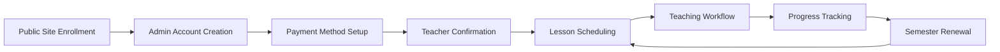

# Cedar Heights Music Academy - Information Architecture

## Executive Summary

This Information Architecture document defines the structural organization, navigation systems, and content hierarchy for the Cedar Heights Music Academy Admin CRM system. Based on comprehensive workflow analysis and user journey mapping, this IA provides the foundation for creating an intuitive, efficient, and scalable user interface that supports the solo-preneur business model.

**Key IA Principles:**
- **User-Centric Design**: Role-based information organization optimized for each user type
- **Efficiency-First**: Minimize clicks and cognitive load for frequent tasks
- **Scalability**: Architecture supports growth from startup to 100+ students
- **Mobile-Responsive**: Critical functions accessible on all device types

## Content Inventory and Feature Analysis

### Core System Features by Priority

#### Phase 1 - Revenue Critical (MVP)
1. **Enrollment Handoff** - Automated student onboarding from public site
2. **Payment Processing** - Stripe integration with automated billing
3. **Teaching Workflow** - Daily lesson management and attendance tracking
4. **Parent Portal** - Customer-facing schedule and payment access
5. **Admin Dashboard** - Business oversight and operational control

#### Phase 2 - Operational Enhancement
6. **Semester Renewal** - Automated retention and timeslot management
7. **Communication System** - Enhanced parent-teacher messaging
8. **Progress Tracking** - Student development and skill assessment
9. **Financial Reporting** - Advanced analytics and export capabilities
10. **System Configuration** - Academic calendar and pricing management

## Information Hierarchy and Content Groupings

### Primary Content Domains

#### 1. Revenue Management Domain
**Purpose**: Financial operations and revenue generation
**Primary Users**: Admin/Owner, Parents
**Key Content**:
- Enrollment pipeline and processing
- Payment history and billing management
- Subscription and recurring payment setup
- Financial reporting and analytics
- Refund and adjustment processing

#### 2. Operational Management Domain
**Purpose**: Daily teaching and scheduling operations
**Primary Users**: Teachers, Admin/Owner
**Key Content**:
- **Admin Schedule Component**: School-wide overview with blocked times, makeup week indicators, all-teacher coordination
- **Teacher Attendance Component**: Individual teacher's students only, blocked time display, quick attendance marking
- **Teacher Availability Management**: Day-based column layout for defining available days and lesson slots
- Student roster and profile management
- Lesson notes and progress documentation
- Schedule validation and conflict resolution

#### 3. Customer Experience Domain
**Purpose**: Parent and student engagement
**Primary Users**: Parents, Students
**Key Content**:
- Student progress and achievement tracking
- Lesson schedules and upcoming appointments
- Payment history and account management
- Communication with teachers and staff
- Account settings and preferences

#### 4. Business Intelligence Domain
**Purpose**: Strategic oversight and decision making
**Primary Users**: Admin/Owner
**Key Content**:
- Key performance indicators and metrics
- Revenue trends and financial forecasting
- Student retention and enrollment analytics
- Operational efficiency measurements
- Alert management and issue resolution

#### 5. System Administration Domain
**Purpose**: Configuration and user management
**Primary Users**: Admin/Owner
**Key Content**:
- Academic calendar and semester management
- Pricing configuration and billing setup
- User accounts and role management
- System settings and integrations
- Security and compliance management

## User-Centric Navigation Architecture

### Dual-Role Navigation Pattern (Admin + Teacher)

For users with both Admin and Teacher roles - the common solo-preneur scenario - the navigation system employs a **contextual role-switching pattern**:

#### Primary Navigation Approach
- **Default View**: Admin navigation with enhanced "My Teaching" section
- **Role Toggle**: Quick-switch button in header to toggle between Admin and Teacher contexts
- **Contextual Indicators**: Clear visual indicators showing current role context

#### Enhanced Admin Navigation for Teaching Owners
```
Dashboard (Home)
├── Business Overview
│   ├── Key Metrics
│   ├── Revenue Summary
│   ├── Alert Center
│   └── Quick Actions
├── My Teaching Today ⭐ (Enhanced for dual-role)
│   ├── My Current Lesson
│   ├── My Upcoming Lessons
│   ├── Quick Attendance Entry
│   └── Student Notes Access
├── Today's Schedule (All Teachers)
│   ├── All Teachers' Current Lessons
│   ├── Upcoming Lessons Across All Teachers
│   ├── Daily Summary by Teacher
│   └── Quick Actions (Reschedule, Mark Attendance)
├── Students
│   ├── My Students ⭐ (Quick access for teaching role)
│   ├── All Students (Admin view)
│   ├── Enrollment Pipeline
│   └── Student Analytics
```

#### Role-Switching Behavior
- **Quick Toggle**: Header button switches between "Admin Mode" and "Teaching Mode"
- **Context Preservation**: System remembers last viewed content in each role
- **Smart Defaults**: During lesson times, system suggests switching to Teaching Mode
- **Unified Data**: All data remains consistent across role views

#### Mobile Optimization for Dual Roles
- **Bottom Tab Bar**: Admin/Teaching toggle as primary tab
- **Swipe Gestures**: Left/right swipe to switch between role contexts
- **Quick Actions**: Teaching-specific quick actions available in Admin mode
- **Notification Badges**: Role-specific notifications clearly labeled

### Admin/Owner Navigation Structure

```
Dashboard (Home)
├── Business Overview
│   ├── Key Metrics
│   ├── Revenue Summary
│   ├── Alert Center
│   └── Quick Actions
├── Schedule ⭐ (Admin-Only School Overview)
│   ├── All Teachers' Current Lessons
│   ├── School-Wide Daily/Weekly Views
│   ├── Blocked Times (School Hours)
│   ├── Makeup Week Indicators
│   ├── Makeup Lessons Display (During Makeup Weeks)
│   └── Conflict Detection Across All Teachers
├── Students
│   ├── Enrollment Pipeline
│   ├── Active Students
│   ├── Semester Renewals
│   └── Student Analytics
├── Financial
│   ├── Revenue Dashboard
│   ├── Payment Issues
│   ├── Billing Management
│   └── Financial Reports
├── Operations
│   ├── Teacher Management
│   ├── Teacher Availability Overview
│   ├── Attendance Tracking (All Students)
│   └── Quality Metrics
├── Communications
│   ├── Message Center
│   ├── Parent Inquiries
│   ├── System Notifications
│   └── Email Templates
└── Settings
    ├── Academic Calendar
    ├── School Hours Configuration
    ├── Pricing Configuration
    ├── User Management
    └── System Configuration
```

### Teacher Navigation Structure

```
Dashboard (Home)
├── Today's Schedule
│   ├── Current Lesson
│   ├── Upcoming Lessons
│   ├── Daily Summary
│   └── Quick Actions
├── Students
│   ├── My Students
│   ├── Student Progress
│   ├── Lesson History
│   └── Attendance Records
├── Availability ⭐ (New Component)
│   ├── Day-Based Column Layout
│   ├── Lesson Slot Management
│   ├── Student Assignment
│   └── Schedule Validation
├── Attendance ⭐ (Teacher-Only)
│   ├── My Students Only
│   ├── Quick Attendance Marking
│   ├── Blocked Time Display
│   └── Makeup Lesson Integration
├── Communications
│   ├── Parent Messages
│   ├── Admin Notifications
│   ├── Message Templates
│   └── Communication History
└── Schedule Changes
    ├── Time Off Requests
    ├── Schedule Modifications
    └── Conflict Resolution
```

### Parent Navigation Structure

```
Dashboard (Home)
├── Student Overview
│   ├── Upcoming Lessons
│   ├── Recent Progress
│   ├── Payment Status
│   └── Quick Actions
├── Schedule
│   ├── Lesson Calendar
│   ├── Upcoming Appointments
│   ├── Schedule Changes
│   └── Absence Reporting
├── Progress
│   ├── Skill Development
│   ├── Lesson Notes
│   ├── Achievement Milestones
│   └── Practice Assignments
├── Payments
│   ├── Payment History
│   ├── Upcoming Charges
│   ├── Payment Methods
│   └── Billing Information
├── Messages
│   ├── Teacher Communications
│   ├── School Announcements
│   ├── Message History
│   └── Contact Information
└── Account
    ├── Profile Settings
    ├── Notification Preferences
    ├── Emergency Contacts
    └── Account Security
```

## Navigation System Design

### Global Navigation Patterns

#### Primary Navigation
- **Top-Level Tabs**: Main functional areas for each user role
- **Persistent Access**: Always visible navigation for core functions
- **Role-Based**: Navigation adapts based on user permissions
- **Mobile Collapse**: Hamburger menu for mobile devices

#### Secondary Navigation
- **Contextual Menus**: Sub-navigation within each primary section
- **Breadcrumb Trails**: Clear path indication for deep navigation
- **Quick Actions**: Floating action buttons for common tasks
- **Search Functionality**: Global search across all accessible content

#### Tertiary Navigation
- **In-Page Navigation**: Tabs and accordions within content areas
- **Filter Controls**: Dynamic content filtering and sorting
- **Pagination**: Efficient handling of large data sets
- **Modal Workflows**: Overlay interfaces for focused tasks

### Mobile Navigation Considerations

#### Responsive Breakpoints
- **Desktop**: >1024px - Full navigation with sidebar
- **Tablet**: 768-1024px - Collapsed sidebar with overlay
- **Mobile**: <768px - Bottom tab bar with hamburger menu

#### Touch-Optimized Design
- **Minimum Touch Targets**: 44px minimum for all interactive elements
- **Swipe Gestures**: Left/right swipe for common navigation
- **Pull-to-Refresh**: Standard mobile refresh patterns
- **Offline Indicators**: Clear status when functionality is limited

## Labeling System and Terminology

### Standardized Terminology

#### Student Management
- **Student**: Individual learner enrolled in lessons
- **Payee**: Parent, guardian or business responsible for payments
- **Enrollment**: Process of joining the music school
- **Timeslot**: Recurring weekly lesson appointment
- **Demo Lesson**: Initial trial lesson for new students

#### Scheduling and Lessons
- **Lesson**: Individual 30-minute teaching session
- **Attendance**: Present/absent status for lessons
- **Makeup Lesson**: Rescheduled lesson for missed appointments
- **Schedule**: Weekly recurring lesson appointments
- **Availability**: Teacher's open timeslots for lessons

#### Financial Terms
- **Billing Cycle**: Monthly recurring payment schedule
- **Prorated Charge**: Partial month billing calculation
- **Subscription**: Automated recurring payment setup
- **Invoice**: Detailed billing statement
- **Payment Method**: Credit card or payment information

#### Academic Structure
- **Semester**: Academic period (Fall, Winter, Spring)
- **Academic Year**: September to August school year
- **Renewal**: Process of continuing to next semester
- **Waitlist**: Queue for popular timeslots
- **Break Period**: Scheduled time off between semesters

### User Interface Labels

#### Action Labels
- **Primary Actions**: "Enroll Student", "Process Payment", "Mark Present"
- **Secondary Actions**: "View Details", "Send Message", "Download Invoice"
- **Destructive Actions**: "Cancel Enrollment", "Suspend Account", "Delete Record"

#### Status Indicators
- **Student Status**: Active, Pending, Suspended, Graduated
- **Payment Status**: Current, Overdue, Failed, Refunded
- **Lesson Status**: Scheduled, Completed, Cancelled, Makeup Required
- **System Status**: Online, Syncing, Offline, Error

## Relationships and Dependencies Between Features

### Core Feature Dependencies

#### Enrollment → Payment → Teaching → Renewal


#### Data Flow Dependencies
- **Student Data**: Enrollment → Teaching → Progress → Renewal
- **Payment Data**: Setup → Processing → History → Reporting
- **Schedule Data**: Availability → Booking → Attendance → Analytics
- **Communication Data**: Messages → History → Templates → Notifications

### Integration Points

#### External System Dependencies
- **Supabase**: User authentication and data storage
- **Stripe**: Payment processing and subscription management
- **Email Service**: Automated notifications and communications
- **Public Website**: Enrollment handoff and marketing integration

#### Internal System Dependencies
- **Authentication**: Required for all user access
- **Student Management**: Foundation for all other features
- **Calendar System**: Core scheduling and availability management
- **Notification System**: Cross-feature communication and alerts

## Scalability Considerations and Constraints

### Technical Scalability

#### Performance Optimization
- **Lazy Loading**: Load content as needed to improve initial page load
- **Caching Strategy**: Client-side caching for frequently accessed data
- **API Optimization**: Efficient data fetching and minimal API calls
- **Bundle Splitting**: Code splitting for faster loading

#### Data Management
- **Pagination**: Handle large datasets efficiently
- **Search Optimization**: Fast search across all content types
- **Real-time Updates**: Live data synchronization where needed
- **Offline Capability**: Core functions available without internet

### Business Scalability

#### User Growth Support
- **Multi-Teacher Architecture**: Support for additional teaching staff
- **Increased Student Capacity**: Handle 100+ students efficiently
- **Role-Based Permissions**: Granular access control for team members
- **Workflow Automation**: Reduce manual tasks as volume increases

#### Feature Extensibility
- **Modular Design**: Easy addition of new features and workflows
- **API-First Architecture**: Support for future integrations
- **Configuration Flexibility**: Adaptable to different business models
- **Reporting Expansion**: Scalable analytics and business intelligence

### Constraints and Limitations

#### Technical Constraints
- **Single Developer**: Architecture must be maintainable by one person
- **Budget Limitations**: Prefer free/low-cost solutions and services
- **Mobile Performance**: Must work well on older mobile devices
- **Browser Compatibility**: Support for modern browsers only

#### Business Constraints
- **Solo Operation**: Interface optimized for single-person management
- **Time Limitations**: Quick task completion prioritized over feature richness
- **Learning Curve**: Minimal training required for all user types
- **Maintenance Overhead**: Self-maintaining systems preferred

## Success Criteria and Validation

### Usability Metrics
- **Task Completion Rate**: >95% success rate for core workflows
- **Time to Complete**: <2 minutes for routine tasks
- **Error Rate**: <5% user errors in critical workflows
- **User Satisfaction**: >4.5/5 rating for interface usability

### Business Impact Metrics
- **Administrative Time Reduction**: 60% decrease in manual tasks
- **User Adoption Rate**: >90% active usage within 30 days
- **Support Request Reduction**: 70% fewer routine inquiries
- **Revenue Impact**: Support for 3x student growth without additional staff

### Technical Performance Metrics
- **Page Load Time**: <2 seconds for all interface pages
- **Mobile Performance**: Equivalent functionality on mobile devices
- **System Reliability**: 99%+ uptime with graceful error handling
- **Data Accuracy**: 100% accuracy in financial and attendance records

---

*This Information Architecture document serves as the comprehensive blueprint for the Cedar Heights Music Academy Admin CRM user interface. All design and development decisions should align with these structural principles to ensure a cohesive, efficient, and scalable user experience.*