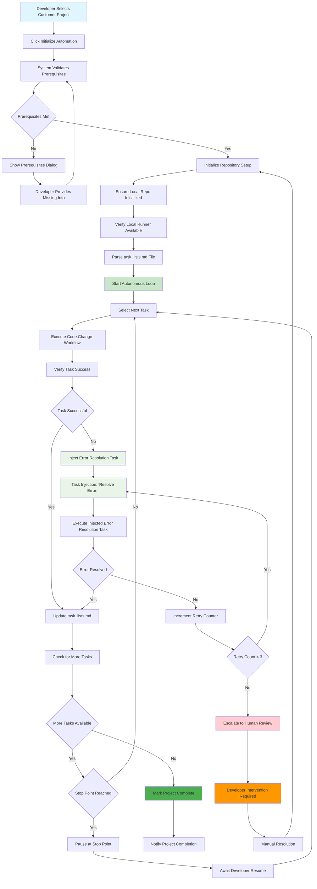
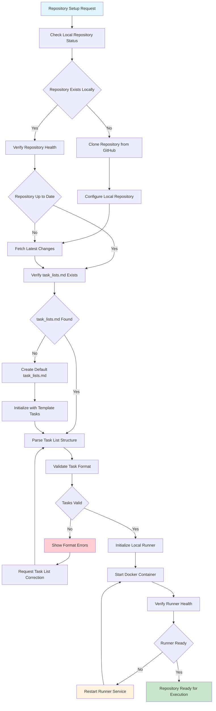
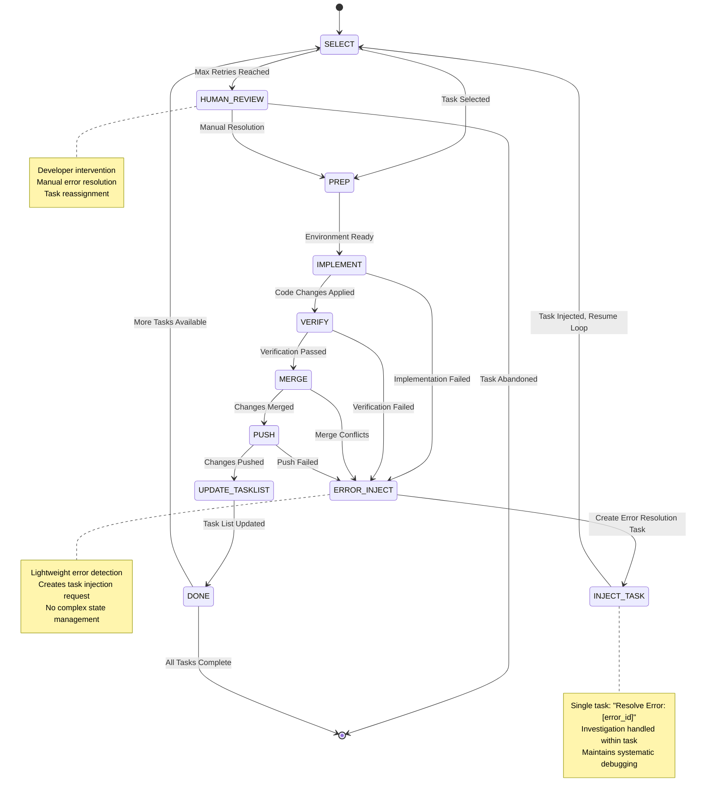
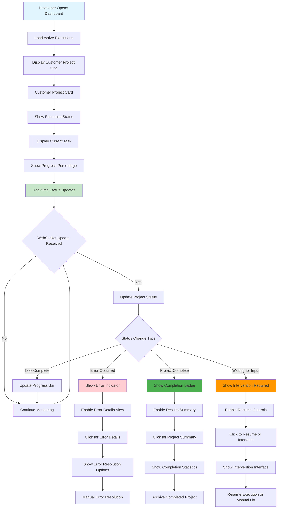
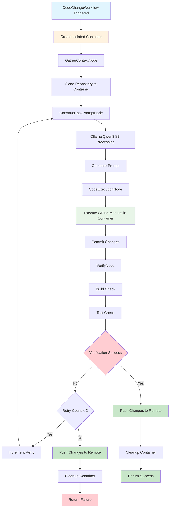
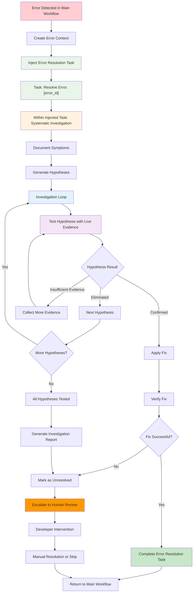
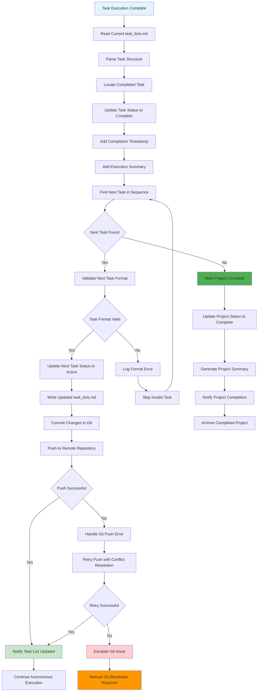
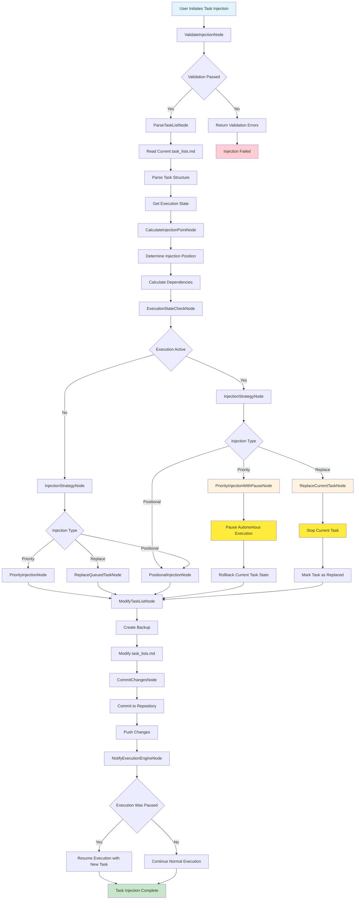
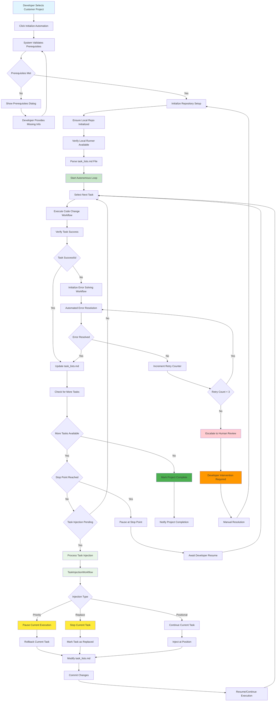
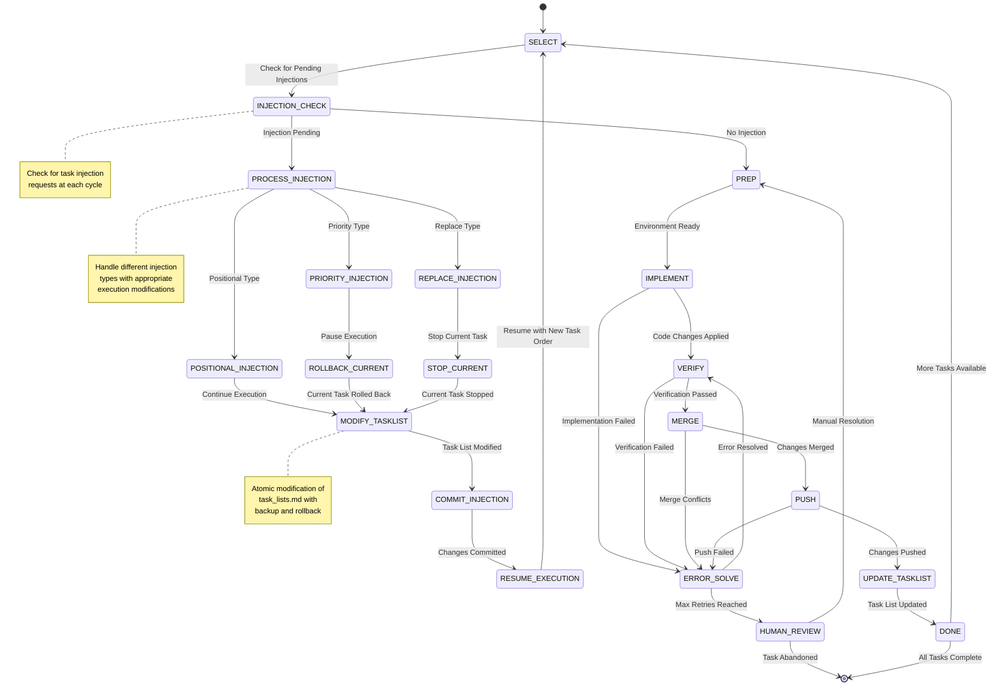

# DevTeam Autonomous Execution Workflows

## Overview

The DevTeam Autonomous Execution Engine transforms manual, step-by-step development workflow into continuous, automated progression across multiple customer projects. This revolutionary system enables developers to initialize task execution and let the system autonomously progress through entire task lists without manual intervention.

## Core Vision

### Multi-Customer Parallel Processing
- Each customer has ≥1 project with GitHub repository containing `task_lists.md`
- System supports simultaneous execution across 5+ customer projects
- Asynchronous processing allows developers to monitor multiple executions
- Real-time progress monitoring when returning to client task panels

### Autonomous Progression
- Developer selects customer/project and initializes execution
- System automatically progresses through tasks without developer intervention
- Continuous execution until all tasks complete or unresolved error occurs
- Optional stop points: Developer can delegate stop after specific task (e.g., task x.x.x.x)

## Primary Autonomous Execution Workflow



## Repository Initialization Workflow



## Task Execution State Machine



## Multi-Customer Dashboard Workflow



## Execute Code Change Workflow (GenAI Launchpad Framework)

**Pattern**: DAG-based workflow with isolated dev containers for autonomous code execution

### Workflow Overview

The Execute Code Change Workflow implements a streamlined pattern:
`gather_context_node > construct_task_prompt_node(Ollama:Qwen3:8b) > code_execution_node(GPT-5-Medium) > verify_node > return context`

**Key Principles**:
- **Start Simple**: Minimal complexity with reasonable guardrails
- **Independent Containers**: Each task runs in its own isolated dev container
- **Reasonable Effort**: Focus on essential verification without over-engineering

### Workflow Schema

```python
class CodeChangeEventSchema(BaseModel):
    task_id: str
    task_description: str
    project_id: str
    repository_url: str
    branch_name: str = "main"
    acceptance_criteria: List[str]
    max_retry_attempts: int = 2  # retry limit

class CodeChangeWorkflow(Workflow):
    workflow_schema = WorkflowSchema(
        description="Autonomous code changes with container isolation",
        event_schema=CodeChangeEventSchema,
        start=GatherContextNode,
        nodes=[
            NodeConfig(
                node=GatherContextNode,
                connections=[ConstructTaskPromptNode],
                description="Gather basic project context"
            ),
            NodeConfig(
                node=ConstructTaskPromptNode,
                connections=[CodeExecutionNode],
                description="Build focused task prompt using Ollama Qwen3 8B"
            ),
            NodeConfig(
                node=CodeExecutionNode,
                connections=[VerifyNode],
                description="Execute code changes via GPT-5 Medium in isolated container"
            ),
            NodeConfig(
                node=VerifyNode,
                connections=[],
                description="build and test verification"
            )
        ]
    )
```

### Node Implementation

#### 1. GatherContextNode (BaseNode)

**Purpose**: Collect essential project context with minimal complexity

```python
class GatherContextNode(Node):
    def __init__(self):
        self.container_manager = DevContainerManager()
    
    async def process(self, task_context: TaskContext) -> TaskContext:
        event = task_context.event
        
        # Create isolated dev container for this task
        container_id = await self.container_manager.create_task_container(
            task_id=event.task_id,
            project_id=event.project_id
        )
        
        # Clone repository into container
        repo_context = await self._setup_repository_in_container(
            container_id,
            event.repository_url,
            event.branch_name
        )
        
        # Store essential context
        task_context.update_node(
            self.node_name,
            container_id=container_id,
            repository_context=repo_context,
            timestamp=datetime.now()
        )
        
        return task_context
    
    async def _setup_repository_in_container(self, container_id: str, repo_url: str, branch: str):
        # repository setup in isolated container
        return await self.container_manager.clone_repository(
            container_id=container_id,
            repo_url=repo_url,
            branch=branch
        )
```

#### 2. ConstructTaskPromptNode (AgentNode)

**Purpose**: Build focused task prompts using Ollama Qwen3 8B

```python
class ConstructTaskPromptNode(AgentNode):
    class OutputType(AgentNode.OutputType):
        focused_prompt: str
        verification_steps: List[str]
    
    def get_agent_config(self) -> AgentConfig:
        return AgentConfig(
            model_provider=ModelProvider.OLLAMA,
            model_name="qwen2.5:8b",
            output_type=self.OutputType,
            system_prompt=self._get_system_prompt(),
            max_retries=2,
            temperature=0.1
        )
    
    def _get_system_prompt(self) -> str:
        return """
        You are a code task prompt constructor. Create focused prompts for code execution.

        KEEP IT 
        - Focus on the specific task only
        - Maximum 2 retry attempts
        - Basic verification requirements
        - Clear success/failure criteria

        OUTPUT REQUIREMENTS:
        - focused_prompt: Clear, actionable prompt for code execution
        - verification_steps: steps to verify success
        """
    
    async def process(self, task_context: TaskContext) -> TaskContext:
        context_data = task_context.nodes.get("GatherContextNode", {})
        
        agent_input = {
            "task_description": task_context.event.task_description,
            "acceptance_criteria": task_context.event.acceptance_criteria,
            "repository_context": context_data.get("repository_context")
        }
        
        result = await self.agent.run(agent_input)
        
        task_context.update_node(
            self.node_name,
            **result.dict(),
            timestamp=datetime.now()
        )
        
        return task_context
```

#### 3. CodeExecutionNode (BaseNode)

**Purpose**: Execute code changes via GPT-5 Medium in isolated dev container

```python
class CodeExecutionNode(Node):
    def __init__(self):
        self.aider_service = AiderService(
            model="gpt-5-medium",  # Preferred over GPT-4
            provider="openai"
        )
        self.container_manager = DevContainerManager()
    
    async def process(self, task_context: TaskContext) -> TaskContext:
        prompt_data = task_context.nodes.get("ConstructTaskPromptNode", {})
        context_data = task_context.nodes.get("GatherContextNode", {})
        
        container_id = context_data.get("container_id")
        focused_prompt = prompt_data.get("focused_prompt")
        repo_context = context_data.get("repository_context")
        
        # Execute in isolated container
        execution_result = await self._execute_in_container(
            container_id,
            focused_prompt,
            repo_context
        )
        
        task_context.update_node(
            self.node_name,
            execution_result=execution_result,
            container_id=container_id,
            timestamp=datetime.now()
        )
        
        return task_context
    
    async def _execute_in_container(self, container_id: str, prompt: str, repo_context):
        try:
            # Execute Aider within the isolated container
            result = await self.container_manager.execute_aider(
                container_id=container_id,
                prompt=prompt,
                model="gpt-5-medium",
                repository_path=repo_context.container_path
            )
            
            return {
                "status": "success",
                "files_modified": result.files_modified,
                "changes_summary": result.summary,
                "commit_hash": result.commit_hash
            }
            
        except Exception as e:
            return {
                "status": "error",
                "error_message": str(e),
                "error_type": type(e).__name__
            }
```

#### 4. VerifyNode (BaseNode)

**Purpose**: verification with basic build and test checks in isolated container

```python
class VerifyNode(Node):
    def __init__(self):
        self.container_manager = DevContainerManager()
    
    async def process(self, task_context: TaskContext) -> TaskContext:
        execution_data = task_context.nodes.get("CodeExecutionNode", {})
        prompt_data = task_context.nodes.get("ConstructTaskPromptNode", {})
        context_data = task_context.nodes.get("GatherContextNode", {})
        
        container_id = context_data.get("container_id")
        verification_steps = prompt_data.get("verification_steps", [])
        execution_result = execution_data.get("execution_result", {})
        
        # verification in container
        verification_result = await self._verify_in_container(
            container_id,
            verification_steps,
            execution_result,
            task_context.event.acceptance_criteria
        )
        
        # retry logic
        should_retry = (
            not verification_result.get("success", False) and
            task_context.metadata.get("retry_count", 0) < task_context.event.max_retry_attempts
        )
        
        if should_retry:
            task_context.metadata["retry_count"] = task_context.metadata.get("retry_count", 0) + 1
        else:
            # Clean up container when done (success or max retries reached)
            await self.container_manager.cleanup_container(container_id)
        
        task_context.update_node(
            self.node_name,
            verification_result=verification_result,
            final_status="success" if verification_result.get("success") else "failed",
            container_cleaned_up=not should_retry,
            timestamp=datetime.now()
        )
        
        return task_context
    
    async def _verify_in_container(self, container_id: str, verification_steps: List[str], execution_result, acceptance_criteria):
        try:
            # build check
            build_result = await self.container_manager.run_build_check(container_id)
            
            if not build_result.success:
                return {
                    "success": False,
                    "build_success": False,
                    "error_message": build_result.error_message
                }
            
            # test run (if tests exist)
            test_result = await self.container_manager.run_tests(container_id)
            
            return {
                "success": build_result.success and test_result.success,
                "build_success": build_result.success,
                "tests_passed": test_result.success,
                "error_message": test_result.error_message if not test_result.success else None
            }
            
        except Exception as e:
            return {
                "success": False,
                "error_message": f"Verification failed: {str(e)}"
            }
```

### Container Management

```python
class DevContainerManager:
    """Manages isolated dev containers for task execution"""
    
    async def create_task_container(self, task_id: str, project_id: str) -> str:
        """Create a new isolated container for task execution"""
        container_config = {
            "image": "node:18-alpine",  # base image
            "name": f"task-{task_id}",
            "labels": {
                "task_id": task_id,
                "project_id": project_id,
                "created_at": datetime.now().isoformat()
            },
            "working_dir": "/workspace",
            "network_mode": "bridge"  # Isolated network
        }
        
        container_id = await self._docker_create_container(container_config)
        await self._docker_start_container(container_id)
        return container_id
    
    async def clone_repository(self, container_id: str, repo_url: str, branch: str):
        """Clone repository into container workspace"""
        clone_command = f"git clone -b {branch} {repo_url} /workspace/repo"
        await self._docker_exec(container_id, clone_command)
        
        return {
            "container_path": "/workspace/repo",
            "branch": branch,
            "repo_url": repo_url
        }
    
    async def execute_aider(self, container_id: str, prompt: str, model: str, repository_path: str):
        """Execute Aider within the container"""
        aider_command = f"cd {repository_path} && aider --model {model} --message '{prompt}'"
        result = await self._docker_exec(container_id, aider_command)
        
        return {
            "files_modified": self._parse_modified_files(result.stdout),
            "summary": result.stdout,
            "commit_hash": self._extract_commit_hash(result.stdout)
        }
    
    async def run_build_check(self, container_id: str):
        """Run build check in container"""
        build_commands = [
            "cd /workspace/repo && npm install",
            "cd /workspace/repo && npm run build"
        ]
        
        for command in build_commands:
            result = await self._docker_exec(container_id, command)
            if result.exit_code != 0:
                return {
                    "success": False,
                    "error_message": result.stderr
                }
        
        return {"success": True}
    
    async def run_tests(self, container_id: str):
        """Run test check in container"""
        test_command = "cd /workspace/repo && npm test"
        result = await self._docker_exec(container_id, test_command)
        
        return {
            "success": result.exit_code == 0,
            "error_message": result.stderr if result.exit_code != 0 else None
        }
    
    async def push_changes(self, container_id: str):
        """Push committed changes to remote repository"""
        try:
            push_command = "cd /workspace/repo && git push origin HEAD"
            result = await self._docker_exec(container_id, push_command)
            
            return {
                "success": result.exit_code == 0,
                "error_message": result.stderr if result.exit_code != 0 else None,
                "push_output": result.stdout
            }
        except Exception as e:
            return {
                "success": False,
                "error_message": f"Push failed: {str(e)}"
            }
    
    async def cleanup_container(self, container_id: str):
        """Clean up container resources"""
        await self._docker_stop_container(container_id)
        await self._docker_remove_container(container_id)
```

### Workflow Execution Flow



### Key Implementations

1. **Container Isolation**: Each task gets its own independent dev container
2. **GPT-5 Medium**: Preferred model for code execution over GPT-4
3. **Verification**: Basic build and test checks, no over-engineering
4. **Reasonable Guardrails**: Maximum 2 retries, automatic cleanup
5. **Minimal Complexity**: Focus on essential functionality only

### Integration with Existing DevTeam Architecture

This workflow integrates with the existing DevTeam autonomous execution system:

- **Replaces**: Line 42 `M[Execute Code Change Workflow]` in the Primary Autonomous Execution Workflow
- **Maintains**: All existing task management patterns with simplified error handling
- **Simplifies**: Reduces complexity while maintaining core functionality
- **Isolates**: Each task runs in its own independent container environment
- **Error Handling**: Uses hybrid error resolution with task injection for major investigation phases

## Hybrid Error Resolution Architecture

**Pattern**: Simplified error resolution using task injection for major investigation phases while maintaining systematic debugging principles

### Hybrid Error Resolution Overview

The Hybrid Error Resolution Architecture simplifies the complex multi-node systematic error resolution workflow by using task injection for major investigation phases only. This approach maintains architectural clarity while reducing state management complexity.

**Key Principles**:
- **Task Injection for Major Phases**: Use task injection only for the overall error resolution, not individual hypotheses
- **Evidence-Based Investigation**: Only accept direct log evidence from live application execution
- **Systematic Debugging Within Tasks**: Handle hypothesis iteration within a single injected task
- **Clear Separation**: Maintain distinction between "building features" and "solving problems"

### Hybrid Architecture Flow



### Error Resolution Task Structure

When an error is detected, the system injects a single task with the following structure:

```markdown
### Error Resolution Task: [error_id]
- **Description**: Systematically investigate and resolve error: [error_message]
- **Acceptance Criteria**:
  - Document observable symptoms without speculation
  - Generate ordered hypotheses (fundamental → dependent)
  - Test each hypothesis with live application evidence
  - Apply fix if root cause identified
  - Generate investigation report
- **Priority**: critical
- **Status**: pending
- **Error Context**:
  - Original Task: [original_task_id]
  - Error Type: [error_type]
  - Container ID: [container_id]
  - Execution Logs: [initial_logs]
- **Investigation State**: Isolated within this task
```

### Systematic Investigation Within Task

The injected error resolution task handles the systematic investigation internally:

#### 1. Symptom Documentation
```python
async def document_symptoms(error_context, execution_logs):
    """Document observable facts without explanation"""
    symptoms = []
    
    # Extract observable facts from logs
    for log_entry in execution_logs:
        if is_error_symptom(log_entry):
            symptoms.append(f"- {log_entry}")
    
    # Add context-based observations
    if error_context.get("exit_code"):
        symptoms.append(f"- Process exited with code {error_context['exit_code']}")
    
    return symptoms
```

#### 2. Hypothesis Generation
```python
async def generate_hypotheses(symptoms, error_context):
    """Generate ordered hypotheses from fundamental to dependent"""
    hypotheses = []
    
    # Order: Most Fundamental → Most Dependent
    # 1. Environment/Configuration
    # 2. Dependencies/Services
    # 3. Application Logic
    # 4. User Interface
    
    return ordered_hypotheses
```

#### 3. Evidence Collection Loop
```python
async def investigate_hypotheses(hypotheses, container_id):
    """Test each hypothesis with live evidence"""
    investigation_results = []
    
    for hypothesis in hypotheses:
        # Add targeted logging
        await add_targeted_logging(container_id, hypothesis)
        
        # Execute live application
        evidence = await execute_for_evidence(container_id, hypothesis)
        
        # Test null hypothesis
        result = await test_null_hypothesis(hypothesis, evidence)
        
        investigation_results.append({
            "hypothesis": hypothesis,
            "evidence": evidence,
            "result": result
        })
        
        # If confirmed, attempt fix
        if result.confirmed:
            fix_result = await apply_fix(hypothesis, container_id)
            if fix_result.successful:
                return {"status": "resolved", "fix": fix_result}
    
    return {"status": "unresolved", "investigation": investigation_results}
```

### State Management

The hybrid approach:

**Hybrid Task Injection**:
- Single error resolution task state
- Investigation state isolated within task
- Simple task completion/failure states
- Standard task injection mechanisms
- No cross-workflow state management

### Integration with Task Injection System

The hybrid error resolution integrates seamlessly with the existing task injection system:

```python
async def handle_execution_error(error_context, original_task):
    """Handle error by injecting resolution task"""
    
    # Create error resolution task
    error_task = {
        "id": f"error_resolution_{generate_id()}",
        "title": f"Resolve Error: {error_context['error_type']}",
        "description": f"Systematically investigate and resolve: {error_context['error_message']}",
        "type": "error_resolution",
        "priority": "critical",
        "error_context": error_context,
        "original_task_id": original_task.id,
        "investigation_methodology": "null_hypothesis_testing"
    }
    
    # Inject as priority task (before current task)
    await inject_task(
        project_id=original_task.project_id,
        injection_type="priority",
        task=error_task,
        reason=f"Error resolution for {original_task.title}"
    )
    
    return {"status": "error_task_injected", "task_id": error_task["id"]}
```

### Benefits of Hybrid Approach

1. **Architectural Clarity**: Clear separation between main workflow and error resolution
2. **Reduced Complexity**: Single task injection instead of complex multi-node workflow
3. **State Isolation**: Investigation state contained within single task
4. **Systematic Debugging**: Maintains null hypothesis testing methodology
5. **Scalability**: Easier to manage multiple concurrent error resolutions
6. **Maintainability**: Simpler codebase with fewer interdependencies

### Error Resolution Task Execution

When the injected error resolution task executes:

1. **Initialize Investigation**: Set up error investigation environment
2. **Document Symptoms**: Record observable facts without speculation
3. **Generate Hypotheses**: Create ordered list from fundamental to dependent
4. **Systematic Testing**: Test each hypothesis with live application evidence
5. **Apply Fixes**: Attempt resolution when root cause identified
6. **Generate Report**: Document investigation process and results
7. **Complete or Escalate**: Mark task complete or escalate to human review

### Integration Points

The hybrid error resolution architecture integrates with existing systems:

- **Replaces**: Complex systematic error resolution workflow (lines 672-1253)
- **Uses**: Existing task injection system for error resolution tasks
- **Maintains**: Evidence-based investigation and null hypothesis testing
- **Simplifies**: State management and workflow orchestration
- **Preserves**: Systematic debugging principles and documentation

## Task List Management Workflow



## Integration Points

### Frontend Integration
- **TaskList Component Enhancement**: Add "Automate Project" button adjacent to existing "Start Timer" button (lines 77-91 in [`TaskList.jsx`](../../src/components/tasks/TaskList.jsx))
- **Redux State Management**: New DevTeam automation slice for execution state management
- **Real-time Updates**: WebSocket integration for live progress monitoring
- **Multi-Customer Dashboard**: New dashboard component for parallel execution monitoring

### Backend Integration
- **GitHub API Integration**: Repository cloning, file management, and task_lists.md parsing
- **Docker Orchestration**: Local runner container management and health monitoring
- **WebSocket Server**: Real-time progress updates and status notifications
- **Hybrid Error Resolution**: Task injection system for error resolution workflows

### Key Dependencies
- **GitHub Repository Access**: Each customer project must have accessible GitHub repository
- **Docker Infrastructure**: Local runner containers for isolated execution environments
- **File System Management**: Local repository cloning and task file parsing
- **WebSocket Communication**: Real-time bidirectional communication for progress updates
- **Task Injection System**: Dynamic task management for error resolution and workflow modifications

## Success Metrics

### Execution Efficiency
- **Task Completion Rate**: Percentage of tasks completed without human intervention
- **Error Resolution Rate**: Percentage of errors resolved automatically within retry limits
- **Multi-Customer Throughput**: Number of simultaneous customer projects processed
- **Average Task Execution Time**: Time from task selection to completion

### Developer Productivity
- **Manual Intervention Frequency**: How often developers need to intervene in autonomous execution
- **Context Switching Reduction**: Decreased time spent switching between customer projects
- **Continuous Progression**: Percentage of time system runs autonomously without stops
- **Stop Point Utilization**: Effectiveness of developer-defined execution boundaries

### System Reliability
- **Repository Initialization Success Rate**: Percentage of successful repo setups
- **Runner Health Uptime**: Availability of local execution environments
- **WebSocket Connection Stability**: Real-time update delivery reliability
- **Data Consistency**: Accuracy of task_lists.md updates and Git synchronization

## Implementation Phases

### Phase 1: Core Autonomous Engine
1. Repository initialization and task parsing
2. Basic autonomous execution loop
3. Task status management and updates
4. error detection and retry logic

### Phase 2: Multi-Customer Support
1. Parallel execution orchestration
2. Customer project isolation
3. Resource allocation and management
4. Basic progress monitoring dashboard

### Phase 3: Advanced Error Resolution
1. Intelligent error categorization
2. Automated debugging workflows
3. Context-aware error resolution
4. Human escalation and intervention

### Phase 4: Real-time Monitoring
1. WebSocket communication infrastructure
2. Live progress updates and notifications
3. Interactive dashboard with controls
4. Performance metrics and analytics

This autonomous execution system represents a fundamental shift from manual task management to continuous, intelligent automation that scales across multiple customer projects while maintaining quality and reliability.

## Task Injection System

**Pattern**: Dynamic task management with real-time task_lists.md modification during autonomous execution

### Task Injection Overview

The Task Injection System extends the linear autonomous execution workflow with dynamic task management capabilities, allowing users to inject tasks at any point during execution without disrupting the autonomous flow.

**Key Principles**:
- **Non-Disruptive**: Task injection occurs without stopping autonomous execution
- **Real-time Modification**: Direct modification of task_lists.md in the repository
- **State Preservation**: Maintains execution state and progress tracking
- **Conflict Resolution**: Handles concurrent modifications safely

### Task Injection Types

#### Option A: Priority Injection (Add Ahead of Current Task)
- **Behavior**: Injects task immediately before the currently executing task
- **Execution Impact**: Rolls back current task, stops execution, restarts with new task first
- **Use Case**: Critical bugs, urgent requirements, blocking dependencies

#### Option B: Stop and Replace Current Task
- **Behavior**: Replaces the currently executing task with the injected task
- **Execution Impact**: Stops current task execution, marks as replaced, starts new task
- **Use Case**: Task scope changes, requirement pivots, better implementation approach

#### Option C: Positional Injection (Insert at Location x.x.x.x)
- **Behavior**: Injects task at specific position in task hierarchy
- **Execution Impact**: No execution stop needed, continues current task, processes injected task when reached
- **Use Case**: Additional features, enhancement requests, future requirements

### Task Injection Architecture

```python
class TaskInjectionEventSchema(BaseModel):
    injection_id: str = Field(description="Unique identifier for injection operation")
    project_id: str = Field(description="Target project identifier")
    repository_url: str = Field(description="GitHub repository URL")
    injection_type: str = Field(description="priority|replace|positional")
    target_position: str = Field(description="Task position for injection (e.g., '2.1.3')")
    injected_task: dict = Field(description="Complete task definition")
    user_id: str = Field(description="User performing injection")
    reason: str = Field(description="Reason for task injection")
    priority_level: str = Field(description="low|medium|high|critical", default="medium")

class TaskInjectionWorkflow(Workflow):
    workflow_schema = WorkflowSchema(
        description="Dynamic task injection with autonomous execution integration",
        event_schema=TaskInjectionEventSchema,
        start=ValidateInjectionNode,
        nodes=[
            NodeConfig(
                node=ValidateInjectionNode,
                connections=[ParseTaskListNode],
                description="Validate injection request and permissions"
            ),
            NodeConfig(
                node=ParseTaskListNode,
                connections=[CalculateInjectionPointNode],
                description="Parse current task_lists.md structure"
            ),
            NodeConfig(
                node=CalculateInjectionPointNode,
                connections=[ExecutionStateCheckNode],
                description="Calculate exact injection position and dependencies"
            ),
            NodeConfig(
                node=ExecutionStateCheckNode,
                connections=[InjectionStrategyNode],
                description="Check current autonomous execution state"
            ),
            NodeConfig(
                node=InjectionStrategyNode,
                connections=[ModifyTaskListNode],
                description="Determine injection strategy based on type and state",
                is_router=True
            ),
            NodeConfig(
                node=ModifyTaskListNode,
                connections=[CommitChangesNode],
                description="Modify task_lists.md with injected task"
            ),
            NodeConfig(
                node=CommitChangesNode,
                connections=[NotifyExecutionEngineNode],
                description="Commit changes to repository"
            ),
            NodeConfig(
                node=NotifyExecutionEngineNode,
                connections=[],
                description="Notify autonomous execution engine of changes"
            )
        ]
    )
```

### Task Injection Workflow Integration



### Enhanced Primary Autonomous Execution Workflow with Task Injection



### Task Injection State Management

The task injection system integrates with the existing autonomous execution state machine by adding injection checkpoints and state transitions.

#### Enhanced Task Execution State Machine with Injection



### Task List Modification Mechanisms

#### Task List File Structure

```markdown
# Project Task List

## 1. Authentication System
### 1.1 User Registration
- **Description**: Implement user registration with email verification
- **Acceptance Criteria**:
  - User can register with email and password
  - Email verification required before activation
  - Password strength validation
- **Priority**: high
- **Status**: completed
- **Estimated Duration**: 4 hours

### 1.2 User Login
- **Description**: Implement secure user login system
- **Acceptance Criteria**:
  - Users can login with email/password
  - Session management implemented
  - Failed login attempt tracking
- **Priority**: high
- **Status**: active
- **Estimated Duration**: 3 hours

## 2. Dashboard Features
### 2.1 User Dashboard
- **Description**: Create main user dashboard
- **Acceptance Criteria**:
  - Display user profile information
  - Show recent activity
  - Navigation to other features
- **Priority**: medium
- **Status**: pending
- **Estimated Duration**: 6 hours
```

#### Injection Examples

**Priority Injection (Option A)**:
```markdown
### 1.1.5 Password Reset (INJECTED)
- **Description**: Critical security fix for password reset
- **Acceptance Criteria**:
  - Secure password reset via email
  - Token expiration handling
  - Rate limiting for reset requests
- **Priority**: critical
- **Status**: pending
- **Estimated Duration**: 2 hours
- **Injection Details**:
  - Injected at: 2024-01-15T10:30:00Z
  - Reason: Security vulnerability discovered
```

**Replace Injection (Option B)**:
```markdown
### 1.2 Enhanced User Login (REPLACED)
- **Description**: Enhanced login with 2FA support
- **Acceptance Criteria**:
  - Users can login with email/password
  - Two-factor authentication support
  - Session management implemented
  - Failed login attempt tracking
- **Priority**: high
- **Status**: pending
- **Estimated Duration**: 5 hours
- **Injection Details**:
  - Injected at: 2024-01-15T11:00:00Z
  - Reason: Security requirements updated
  - Replaced: Original User Login task
```

**Positional Injection (Option C)**:
```markdown
### 2.1.5 Dashboard Analytics
- **Description**: Add analytics tracking to dashboard
- **Acceptance Criteria**:
  - Track user interactions
  - Generate usage reports
  - Privacy-compliant data collection
- **Priority**: low
- **Status**: pending
- **Estimated Duration**: 4 hours
- **Injection Details**:
  - Injected at: 2024-01-15T14:00:00Z
  - Reason: Analytics requirements added
```

### Integration with Existing DevTeam Architecture

The Task Injection System integrates seamlessly with the existing DevTeam autonomous execution system:

- **Extends**: Primary Autonomous Execution Workflow with injection checkpoints
- **Maintains**: All existing error resolution and task management patterns
- **Enhances**: Provides dynamic task management without disrupting autonomous flow
- **Preserves**: Execution state and progress tracking across injections

### API Endpoints for Task Injection

```javascript
// Task Injection API
POST /api/devteam/projects/{projectId}/tasks/inject
{
  "injection_type": "priority|replace|positional",
  "target_position": "2.1.3", // Optional for positional
  "task": {
    "id": "unique-task-id",
    "title": "Task Title",
    "description": "Task description",
    "acceptance_criteria": ["Criteria 1", "Criteria 2"],
    "priority": "high|medium|low|critical",
    "estimated_duration": "4 hours"
  },
  "reason": "Reason for injection",
  "user_id": "user-performing-injection"
}

// Get Injection Status
GET /api/devteam/projects/{projectId}/injections/{injectionId}

// List Pending Injections
GET /api/devteam/projects/{projectId}/injections?status=pending

// Cancel Injection (if not yet processed)
DELETE /api/devteam/projects/{projectId}/injections/{injectionId}
```

### Frontend Integration Points

#### TaskList Component Enhancement
```jsx
// Add task injection controls to existing TaskList component
const TaskInjectionControls = ({ projectId, currentTaskPosition }) => {
  const [injectionType, setInjectionType] = useState('positional')
  const [showInjectionModal, setShowInjectionModal] = useState(false)
  
  const handleInjectTask = useCallback(async (taskData) => {
    const injectionRequest = {
      injection_type: injectionType,
      target_position: injectionType === 'positional' ? taskData.position : undefined,
      task: taskData,
      reason: taskData.injection_reason,
      user_id: currentUser.id
    }
    
    await dispatch(injectTask({ projectId, ...injectionRequest }))
  }, [injectionType, projectId, dispatch])
  
  return (
    <InjectionControlsContainer>
      <InjectionTypeSelector
        value={injectionType}
        onChange={setInjectionType}
        options={[
          { value: 'priority', label: 'Add Before Current Task' },
          { value: 'replace', label: 'Replace Current Task' },
          { value: 'positional', label: 'Insert at Position' }
        ]}
      />
      <InjectTaskButton onClick={() => setShowInjectionModal(true)}>
        Inject Task
      </InjectTaskButton>
      
      {showInjectionModal && (
        <TaskInjectionModal
          injectionType={injectionType}
          currentPosition={currentTaskPosition}
          onSubmit={handleInjectTask}
          onClose={() => setShowInjectionModal(false)}
        />
      )}
    </InjectionControlsContainer>
  )
}
```

#### Redux State Management
```javascript
// Task injection slice
const taskInjectionSlice = createSlice({
  name: 'taskInjection',
  initialState: {
    pendingInjections: [],
    injectionHistory: [],
    loading: false,
    error: null
  },
  reducers: {
    clearError: (state) => {
      state.error = null
    }
  },
  extraReducers: (builder) => {
    builder
      .addCase(injectTask.pending, (state) => {
        state.loading = true
        state.error = null
      })
      .addCase(injectTask.fulfilled, (state, action) => {
        state.loading = false
        state.pendingInjections.push(action.payload)
      })
      .addCase(injectTask.rejected, (state, action) => {
        state.loading = false
        state.error = action.payload
      })
  }
})
```

This comprehensive Task Injection System provides the three requested injection types while maintaining the autonomous execution flow and ensuring safe modification of the underlying task_lists.md file.