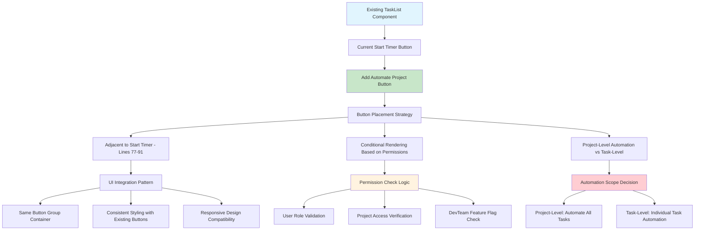
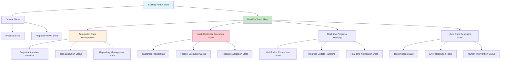
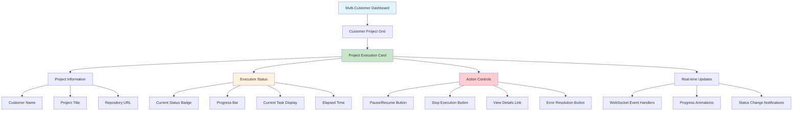
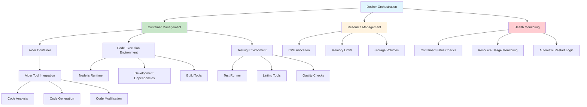
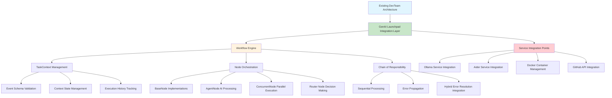
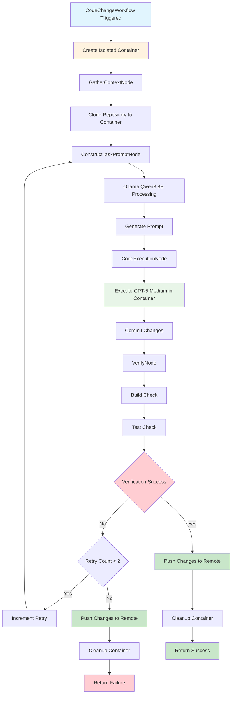

# DevTeam Integration Patterns and Dependencies

## Overview

This document outlines the comprehensive integration patterns, dependencies, and technical implementation details for the DevTeam Autonomous Execution Engine within the existing Clarity CRM Frontend architecture.

## Frontend Integration Patterns

### TaskList Component Enhancement

**Integration Point**: [`src/components/tasks/TaskList.jsx`](../../src/components/tasks/TaskList.jsx) lines 77-91



#### Implementation Pattern

```javascript
// Enhanced TaskItem component with automation button
const TaskItem = React.memo(function TaskItem({
    task,
    projectId,
    darkMode,
    // ... existing props
}) {
    const { user } = useAppState();
    const dispatch = useDispatch();
    const { automationStatus, canAutomate } = useSelector(state => state.devTeam);
    
    const handleAutomateProject = useCallback(async () => {
        if (canAutomate && projectId) {
            dispatch(initializeProjectAutomation({ projectId, userId: user.userID }));
        }
    }, [dispatch, projectId, user.userID, canAutomate]);

    return (
        <div className="task-item">
            {/* Existing task content */}
            <div className="task-actions">
                {!task.isCompleted && (
                    <>
                        {/* Existing Start Timer button */}
                        <button onClick={handleTimerStart}>
                            Start Timer
                        </button>
                        
                        {/* New Automate Project button */}
                        {canAutomate && (
                            <button 
                                onClick={handleAutomateProject}
                                disabled={automationStatus === 'running'}
                                className="automate-button"
                            >
                                {automationStatus === 'running' ? 'Automating...' : 'Automate Project'}
                            </button>
                        )}
                    </>
                )}
            </div>
        </div>
    );
});
```

### Redux State Management Integration

**Pattern**: Extend existing Redux store with DevTeam automation slice



#### DevTeam Redux Slice Implementation

```javascript
// src/store/slices/devTeamSlice.js
import { createSlice, createAsyncThunk } from '@reduxjs/toolkit';

export const initializeProjectAutomation = createAsyncThunk(
    'devTeam/initializeProjectAutomation',
    async ({ projectId, userId }, { rejectWithValue }) => {
        try {
            const response = await devTeamApi.initializeAutomation({ projectId, userId });
            return response.data;
        } catch (error) {
            return rejectWithValue(error.message);
        }
    }
);

export const fetchAutomationStatus = createAsyncThunk(
    'devTeam/fetchAutomationStatus',
    async (projectId, { rejectWithValue }) => {
        try {
            const response = await devTeamApi.getAutomationStatus(projectId);
            return response.data;
        } catch (error) {
            return rejectWithValue(error.message);
        }
    }
);

const devTeamSlice = createSlice({
    name: 'devTeam',
    initialState: {
        // Multi-customer execution state
        activeExecutions: new Map(),
        executionQueue: [],
        
        // Current project automation
        currentAutomation: null,
        automationStatus: 'idle', // idle, initializing, running, paused, completed, error
        
        // Progress tracking
        currentTask: null,
        completedTasks: [],
        totalTasks: 0,
        progressPercentage: 0,
        
        // Hybrid error resolution
        lastError: null,
        retryCount: 0,
        errorResolutionInProgress: false,
        injectedErrorTasks: [],
        
        // WebSocket connection
        wsConnected: false,
        lastUpdate: null,
        
        // Permissions and capabilities
        canAutomate: false,
        userPermissions: [],
        
        // UI state
        loading: false,
        error: null
    },
    reducers: {
        // WebSocket event handlers
        updateExecutionProgress: (state, action) => {
            const { projectId, progress } = action.payload;
            if (state.activeExecutions.has(projectId)) {
                state.activeExecutions.get(projectId).progress = progress;
            }
            if (state.currentAutomation?.projectId === projectId) {
                state.progressPercentage = progress.percentage;
                state.currentTask = progress.currentTask;
            }
        },
        
        setWebSocketConnected: (state, action) => {
            state.wsConnected = action.payload;
        },
        
        addExecutionToQueue: (state, action) => {
            state.executionQueue.push(action.payload);
        },
        
        removeExecutionFromQueue: (state, action) => {
            const projectId = action.payload;
            state.executionQueue = state.executionQueue.filter(
                execution => execution.projectId !== projectId
            );
        },
        
        updateTaskStatus: (state, action) => {
            const { taskId, status } = action.payload;
            if (state.currentTask?.id === taskId) {
                state.currentTask.status = status;
            }
        },
        
        addInjectedErrorTask: (state, action) => {
            state.injectedErrorTasks.push(action.payload);
        },
        
        clearError: (state) => {
            state.error = null;
            state.lastError = null;
        }
    },
    extraReducers: (builder) => {
        builder
            // Initialize Project Automation
            .addCase(initializeProjectAutomation.pending, (state) => {
                state.loading = true;
                state.error = null;
                state.automationStatus = 'initializing';
            })
            .addCase(initializeProjectAutomation.fulfilled, (state, action) => {
                state.loading = false;
                state.currentAutomation = action.payload;
                state.automationStatus = 'running';
                state.activeExecutions.set(action.payload.projectId, action.payload);
            })
            .addCase(initializeProjectAutomation.rejected, (state, action) => {
                state.loading = false;
                state.error = action.payload;
                state.automationStatus = 'error';
            })
            
            // Fetch Automation Status
            .addCase(fetchAutomationStatus.fulfilled, (state, action) => {
                const status = action.payload;
                state.automationStatus = status.status;
                state.progressPercentage = status.progress;
                state.currentTask = status.currentTask;
                state.completedTasks = status.completedTasks;
                state.totalTasks = status.totalTasks;
            });
    }
});

export const {
    updateExecutionProgress,
    setWebSocketConnected,
    addExecutionToQueue,
    removeExecutionFromQueue,
    updateTaskStatus,
    addInjectedErrorTask,
    clearError
} = devTeamSlice.actions;

export default devTeamSlice.reducer;
```

### Multi-Customer Dashboard Component

**Pattern**: New dashboard component for parallel execution monitoring



## Backend Integration Dependencies

### GitHub API Integration

**Dependency**: GitHub repository access and management

```mermaid
graph TB
    A[GitHub API Integration] --> B[Repository Operations]
    B --> C[Clone Repository]
    B --> D[Fetch Repository Info]
    B --> E[Read task_lists.md]
    B --> F[Update task_lists.md]
    B --> G[Commit Changes]
    B --> H[Push Updates]
    
    A --> I[Authentication]
    I --> J[GitHub Personal Access Token]
    I --> K[OAuth App Integration]
    I --> L[Repository Permissions]
    
    A --> M[File Management]
    M --> N[Parse Markdown Files]
    M --> O[Validate Task Format]
    M --> P[Generate Task Updates]
    
    A --> Q[Error Handling]
    Q --> R[Network Failures]
    Q --> S[Authentication Errors]
    Q --> T[Merge Conflicts]
    Q --> U[Permission Denied]
    
    style A fill:#e1f5fe
    style B fill:#c8e6c9
    style I fill:#fff3e0
    style Q fill:#ffcdd2
```



### Docker Container Orchestration

**Dependency**: Local runner environment management



### WebSocket Communication Infrastructure

**Dependency**: Real-time bidirectional communication

```mermaid
graph TB
    A[WebSocket Infrastructure] --> B[Connection Management]
    B --> C[Client Connection Handling]
    B --> D[Connection Pool Management]
    B --> E[Reconnection Logic]
    
    A --> F[Message Routing]
    F --> G[Project-Specific Channels]
    F --> H[User-Specific Updates]
    F --> I[Broadcast Messages]
    
    A --> J[Event Types]
    J --> K[Progress Updates]
    J --> L[Status Changes]
    J --> M[Error Notifications]
    J --> N[Completion Events]
    
    A --> O[Security]
    O --> P[Authentication Verification]
    O --> Q[Authorization Checks]
    O --> R[Message Validation]
    
    A --> S[Scalability]
    S --> T[Multiple Client Support]
    S --> U[Load Balancing]
    S --> V[Message Queuing]
    
    style A fill:#e1f5fe
    style B fill:#c8e6c9
    style F fill:#fff3e0
    style O fill:#ffcdd2
```



## API Extensions and Endpoints

### DevTeam Automation API

**Pattern**: Extend existing API structure with automation endpoints

```javascript
// src/api/devTeam.js
import { apiClient } from './index';

export const devTeamApi = {
    // Project automation management
    initializeAutomation: async ({ projectId, userId, stopPoint = null }) => {
        return apiClient.post('/api/devteam/automation/initialize', {
            projectId,
            userId,
            stopPoint
        });
    },
    
    getAutomationStatus: async (projectId) => {
        return apiClient.get(`/api/devteam/automation/status/${projectId}`);
    },
    
    pauseAutomation: async (projectId) => {
        return apiClient.post(`/api/devteam/automation/pause/${projectId}`);
    },
    
    resumeAutomation: async (projectId) => {
        return apiClient.post(`/api/devteam/automation/resume/${projectId}`);
    },
    
    stopAutomation: async (projectId) => {
        return apiClient.post(`/api/devteam/automation/stop/${projectId}`);
    },
    
    // Repository management
    validateRepository: async (repositoryUrl) => {
        return apiClient.post('/api/devteam/repository/validate', {
            repositoryUrl
        });
    },
    
    getTaskList: async (projectId) => {
        return apiClient.get(`/api/devteam/repository/tasks/${projectId}`);
    },
    
    updateTaskStatus: async (projectId, taskId, status) => {
        return apiClient.put(`/api/devteam/repository/tasks/${projectId}/${taskId}`, {
            status
        });
    },
    
    // Hybrid error resolution
    getErrorDetails: async (executionId, errorId) => {
        return apiClient.get(`/api/devteam/errors/${executionId}/${errorId}`);
    },
    
    injectErrorResolutionTask: async (projectId, errorContext) => {
        return apiClient.post(`/api/devteam/tasks/inject`, {
            projectId,
            injectionType: 'priority',
            task: {
                type: 'error_resolution',
                title: `Resolve Error: ${errorContext.errorType}`,
                description: `Systematically investigate and resolve: ${errorContext.errorMessage}`,
                priority: 'critical',
                errorContext
            },
            reason: 'Automated error resolution via task injection'
        });
    },
    
    // Multi-customer dashboard
    getActiveExecutions: async (userId) => {
        return apiClient.get(`/api/devteam/executions/active/${userId}`);
    },
    
    getExecutionHistory: async (userId, limit = 50) => {
        return apiClient.get(`/api/devteam/executions/history/${userId}?limit=${limit}`);
    }
};
```

## Service Layer Extensions

### Task Service Enhancement

**Pattern**: Extend existing [`taskService.js`](../../src/services/taskService.js) with automation capabilities

```javascript
// Enhanced taskService.js with DevTeam automation
import { devTeamApi } from '../api/devTeam';

// Existing task service functions...

// New DevTeam automation functions
export const automationService = {
    validateTaskForAutomation: (task) => {
        const requirements = {
            hasDescription: !!task.description && task.description.trim().length > 0,
            hasAcceptanceCriteria: task.notes?.some(note => 
                note.content.toLowerCase().includes('acceptance criteria')
            ),
            isNotCompleted: !task.isCompleted,
            hasProjectId: !!task.projectId
        };
        
        const isValid = Object.values(requirements).every(Boolean);
        const missingRequirements = Object.entries(requirements)
            .filter(([_, met]) => !met)
            .map(([requirement]) => requirement);
            
        return {
            isValid,
            requirements,
            missingRequirements
        };
    },
    
    prepareAutomationContext: async (projectId) => {
        try {
            const [tasks, project, repository] = await Promise.all([
                loadProjectTasks(projectId),
                loadProjectDetails(projectId),
                devTeamApi.validateRepository(project.repositoryUrl)
            ]);
            
            return {
                tasks: tasks.filter(task => !task.isCompleted),
                project,
                repository: repository.data,
                automationEligible: tasks.filter(task => 
                    automationService.validateTaskForAutomation(task).isValid
                )
            };
        } catch (error) {
            console.error('Error preparing automation context:', error);
            throw error;
        }
    },
    
    estimateAutomationDuration: (tasks) => {
        const baseTimePerTask = 15; // minutes
        const complexityMultipliers = {
            simple: 1,
            medium: 1.5,
            complex: 2.5
        };
        
        return tasks.reduce((total, task) => {
            const complexity = task.complexity || 'medium';
            const multiplier = complexityMultipliers[complexity] || 1.5;
            return total + (baseTimePerTask * multiplier);
        }, 0);
    },
    
    // Hybrid error resolution support
    handleExecutionError: async (errorContext, originalTask) => {
        try {
            // Inject error resolution task using task injection system
            const injectionResult = await devTeamApi.injectErrorResolutionTask(
                originalTask.projectId,
                errorContext
            );
            
            return {
                status: 'error_task_injected',
                taskId: injectionResult.data.taskId,
                injectionId: injectionResult.data.injectionId
            };
        } catch (error) {
            console.error('Error injecting resolution task:', error);
            throw error;
        }
    }
};
```

## Integration Testing Patterns

### Component Integration Tests

**Pattern**: Test DevTeam integration with existing components

```javascript
// src/components/tasks/__tests__/TaskList.devteam.test.js
import React from 'react';
import { render, screen, fireEvent, waitFor } from '@testing-library/react';
import { Provider } from 'react-redux';
import { configureStore } from '@reduxjs/toolkit';
import TaskList from '../TaskList';
import devTeamReducer from '../../store/slices/devTeamSlice';

const createTestStore = (initialState = {}) => {
    return configureStore({
        reducer: {
            devTeam: devTeamReducer
        },
        preloadedState: {
            devTeam: {
                canAutomate: true,
                automationStatus: 'idle',
                injectedErrorTasks: [],
                ...initialState
            }
        }
    });
};

describe('TaskList DevTeam Integration', () => {
    test('shows automate button when user has permissions', () => {
        const store = createTestStore();
        
        render(
            <Provider store={store}>
                <TaskList projectId="test-project" />
            </Provider>
        );
        
        expect(screen.getByText('Automate Project')).toBeInTheDocument();
    });
    
    test('disables automate button when automation is running', () => {
        const store = createTestStore({
            automationStatus: 'running'
        });
        
        render(
            <Provider store={store}>
                <TaskList projectId="test-project" />
            </Provider>
        );
        
        const automateButton = screen.getByText('Automating...');
        expect(automateButton).toBeDisabled();
    });
    
    test('initiates automation when automate button is clicked', async () => {
        const store = createTestStore();
        
        render(
            <Provider store={store}>
                <TaskList projectId="test-project" />
            </Provider>
        );
        
        const automateButton = screen.getByText('Automate Project');
        fireEvent.click(automateButton);
        
        await waitFor(() => {
            const state = store.getState();
            expect(state.devTeam.automationStatus).toBe('initializing');
        });
    });
    
    test('handles hybrid error resolution with task injection', async () => {
        const store = createTestStore({
            injectedErrorTasks: [{
                id: 'error_resolution_123',
                type: 'error_resolution',
                title: 'Resolve Error: Build Failed',
                priority: 'critical'
            }]
        });
        
        render(
            <Provider store={store}>
                <TaskList projectId="test-project" />
            </Provider>
        );
        
        expect(screen.getByText('Resolve Error: Build Failed')).toBeInTheDocument();
        expect(screen.getByText('critical')).toBeInTheDocument();
    });
});
```

## GenAI Launchpad Integration Architecture

### GenAI Workflow Engine Integration

**Pattern**: Integrate GenAI Launchpad DAG-based workflow orchestration with existing DevTeam architecture



### GenAI Service Dependencies

#### Ollama Integration

**Dependency**: Local Ollama service for prompt construction using Qwen3 8B model

```javascript
// src/services/ollamaService.js
import { OllamaClient } from '@ollama/client';

export class OllamaService {
    constructor() {
        this.client = new OllamaClient({
            host: process.env.OLLAMA_HOST || 'http://localhost:11434'
        });
        this.model = 'qwen2.5:8b';
    }
    
    async constructTaskPrompt(taskContext) {
        const systemPrompt = this._buildSystemPrompt();
        const userPrompt = this._buildUserPrompt(taskContext);
        
        try {
            const response = await this.client.chat({
                model: this.model,
                messages: [
                    { role: 'system', content: systemPrompt },
                    { role: 'user', content: userPrompt }
                ],
                options: {
                    temperature: 0.1,
                    top_p: 0.9,
                    max_tokens: 2048
                }
            });
            
            return this._parseStructuredOutput(response.message.content);
        } catch (error) {
            throw new Error(`Ollama prompt construction failed: ${error.message}`);
        }
    }
    
    _buildSystemPrompt() {
        return `
        You are a specialized code task prompt constructor. Your ONLY responsibility is to create focused, actionable prompts for code execution.

        CRITICAL CONSTRAINTS:
        - Keep focus VERY tight on the specific task assigned
        - You CANNOT perform additional tasks beyond prompt construction
        - Require verification of code functionality
        - Mandate 2 correction attempts maximum
        - Report results with error reproduction steps if failures occur

        PROMPT BUILDING BEST PRACTICES:
        1. Start with clear, specific objective
        2. Include acceptance criteria as verification checkpoints
        3. Specify exact files/components to modify
        4. Define success/failure criteria explicitly
        5. Include rollback instructions for failures
        6. Limit scope to prevent scope creep

        OUTPUT FORMAT (JSON):
        {
            "focused_prompt": "Precise, actionable prompt for code execution",
            "task_constraints": ["List of boundaries and limitations"],
            "verification_steps": ["Specific steps to verify success"],
            "error_handling_strategy": "How to handle and report failures",
            "estimated_complexity": "simple|medium|complex"
        }
        `;
    }
    
    _buildUserPrompt(taskContext) {
        return `
        Task Description: ${taskContext.task_description}
        
        Acceptance Criteria:
        ${taskContext.acceptance_criteria.map(criteria => `- ${criteria}`).join('\n')}
        
        Repository Context:
        - Project Type: ${taskContext.repository_context?.project_type || 'Unknown'}
        - Main Language: ${taskContext.repository_context?.main_language || 'Unknown'}
        - Framework: ${taskContext.repository_context?.framework || 'Unknown'}
        
        File Context:
        ${taskContext.file_context?.map(file => `- ${file.path}: ${file.summary}`).join('\n') || 'No specific files provided'}
        
        Generate a focused prompt for this code change task.
        `;
    }
    
    _parseStructuredOutput(content) {
        try {
            // Extract JSON from response
            const jsonMatch = content.match(/\{[\s\S]*\}/);
            if (jsonMatch) {
                return JSON.parse(jsonMatch[0]);
            }
            throw new Error('No valid JSON found in response');
        } catch (error) {
            throw new Error(`Failed to parse Ollama response: ${error.message}`);
        }
    }
}
```

#### Aider Service Integration

**Dependency**: Aider service integration for code execution via OpenAI GPT-4

```javascript
// src/services/aiderService.js
import { spawn } from 'child_process';
import { promises as fs } from 'fs';
import path from 'path';

export class AiderService {
    constructor() {
        this.model = 'gpt-4';
        this.provider = 'openai';
    }
    
    async executeChanges(prompt, config) {
        const { repository_path, constraints = [] } = config;
        
        try {
            // Prepare Aider execution environment
            const aiderConfig = await this._prepareAiderConfig(repository_path, constraints);
            
            // Execute Aider with focused prompt
            const result = await this._runAider(prompt, aiderConfig);
            
            // Parse and validate results
            return this._processAiderOutput(result);
            
        } catch (error) {
            throw new Error(`Aider execution failed: ${error.message}`);
        }
    }
    
    async _prepareAiderConfig(repoPath, constraints) {
        // Create Aider configuration
        const configPath = path.join(repoPath, '.aider.conf.yml');
        const config = {
            model: this.model,
            auto_commits: true,
            dirty_commits: false,
            attribute_author: true,
            attribute_committer: true,
            constraints: constraints
        };
        
        await fs.writeFile(configPath, JSON.stringify(config, null, 2));
        return configPath;
    }
    
    async _runAider(prompt, configPath) {
        return new Promise((resolve, reject) => {
            const aiderProcess = spawn('aider', [
                '--config', configPath,
                '--message', prompt,
                '--yes'  // Auto-confirm changes
            ], {
                cwd: path.dirname(configPath),
                stdio: ['pipe', 'pipe', 'pipe']
            });
            
            let stdout = '';
            let stderr = '';
            
            aiderProcess.stdout.on('data', (data) => {
                stdout += data.toString();
            });
            
            aiderProcess.stderr.on('data', (data) => {
                stderr += data.toString();
            });
            
            aiderProcess.on('close', (code) => {
                if (code === 0) {
                    resolve({ stdout, stderr, exitCode: code });
                } else {
                    reject(new Error(`Aider process failed with code ${code}: ${stderr}`));
                }
            });
            
            aiderProcess.on('error', (error) => {
                reject(new Error(`Failed to start Aider process: ${error.message}`));
            });
        });
    }
    
    _processAiderOutput(result) {
        const { stdout, stderr } = result;
        
        // Parse Aider output for file changes and commit information
        const filesModified = this._extractModifiedFiles(stdout);
        const commitHash = this._extractCommitHash(stdout);
        const changesSummary = this._extractChangesSummary(stdout);
        
        return {
            files_modified: filesModified,
            commit_hash: commitHash,
            changes_summary: changesSummary,
            raw_output: stdout,
            errors: stderr
        };
    }
    
    _extractModifiedFiles(output) {
        // Extract modified files from Aider output
        const fileRegex = /Modified: (.+)/g;
        const matches = [];
        let match;
        
        while ((match = fileRegex.exec(output)) !== null) {
            matches.push(match[1].trim());
        }
        
        return matches;
    }
    
    _extractCommitHash(output) {
        // Extract commit hash from Aider output
        const commitRegex = /Commit ([a-f0-9]{7,40})/i;
        const match = output.match(commitRegex);
        return match ? match[1] : null;
    }
    
    _extractChangesSummary(output) {
        // Extract changes summary from Aider output
        const summaryRegex = /Summary: (.+)/i;
        const match = output.match(summaryRegex);
        return match ? match[1].trim() : 'Code changes applied';
    }
}
```

### Workflow Execution Flow



### Key Implementations

1. **Container Isolation**: Each task gets its own independent dev container
2. **GPT-5 Medium**: Preferred model for code execution over GPT-4
3. **Verification**: Basic build and test checks, no over-engineering
4. **Reasonable Guardrails**: Maximum 2 retries, automatic cleanup
5. **Minimal Complexity**: Focus on essential functionality only

### Integration with Existing DevTeam Architecture

This workflow integrates with the existing DevTeam autonomous execution system:

- **Replaces**: Line 42 `M[Execute Code Change Workflow]` in the Primary Autonomous Execution Workflow
- **Maintains**: All existing task management patterns with hybrid error resolution
- **Simplifies**: Reduces complexity while maintaining core functionality
- **Isolates**: Each task runs in its own independent container environment
- **Error Handling**: Uses hybrid error resolution with task injection for major investigation phases

## Component Integration Patterns

**Pattern**: Integrate GenAI workflow controls into existing TaskList component

```javascript
// Enhanced TaskList component with GenAI workflow integration
import React, { useCallback, useEffect } from 'react';
import { useDispatch, useSelector } from 'react-redux';
import { executeCodeChangeWorkflow, getWorkflowStatus } from '../../store/slices/genaiWorkflowSlice';

const TaskListWithGenAI = ({ projectId, tasks }) => {
    const dispatch = useDispatch();
    const {
        workflowStatus,
        currentNode,
        executionProgress,
        ollamaHealth,
        aiderHealth,
        loading
    } = useSelector(state => state.genaiWorkflow);
    
    const handleExecuteWithGenAI = useCallback(async (task) => {
        const workflowData = {
            task_id: task.id,
            task_description: task.description,
            project_id: projectId,
            repository_url: task.project?.repositoryUrl,
            acceptance_criteria: task.acceptanceCriteria || [],
            context_files: task.contextFiles || [],
            max_retry_attempts: 2
        };
        
        dispatch(executeCodeChangeWorkflow(workflowData));
    }, [dispatch, projectId]);
    
    const canExecuteGenAI = useCallback((task) => {
        return (
            !task.isCompleted &&
            task.description?.trim().length > 0 &&
            ollamaHealth === 'healthy' &&
            aiderHealth === 'healthy' &&
            workflowStatus !== 'running'
        );
    }, [ollamaHealth, aiderHealth, workflowStatus]);
    
    return (
        <div className="task-list-genai">
            {tasks.map(task => (
                <div key={task.id} className="task-item">
                    {/* Existing task content */}
                    <div className="task-content">
                        <h3>{task.title}</h3>
                        <p>{task.description}</p>
                    </div>
                    
                    {/* GenAI execution controls */}
                    <div className="task-actions">
                        {canExecuteGenAI(task) && (
                            <button
                                onClick={() => handleExecuteWithGenAI(task)}
                                disabled={loading}
                                className="genai-execute-button"
                            >
                                {loading ? 'Executing...' : 'Execute with GenAI'}
                            </button>
                        )}
                        
                        {workflowStatus === 'running' && (
                            <div className="workflow-progress">
                                <div className="progress-bar">
                                    <div
                                        className="progress-fill"
                                        style={{ width: `${executionProgress}%` }}
                                    />
                                </div>
                                <span className="current-node">
                                    Current: {currentNode}
                                </span>
                            </div>
                        )}
                    </div>
                </div>
            ))}
        </div>
    );
};

export default TaskListWithGenAI;
```

## Migration Strategy

### Phase 1: GenAI Foundation Integration
1. **GenAI Service Setup**: Deploy Ollama service with Qwen3 8B model
2. **Aider Service Integration**: Configure Aider with OpenAI GPT-4 access
3. **Workflow Engine Implementation**: Implement GenAI Launchpad workflow engine
4. **Basic Node Implementations**: Create GatherContext, ConstructPrompt, CodeExecution, and Verify nodes

### Phase 2: Core GenAI Functionality
1. **Workflow Schema Definition**: Implement CodeChangeEventSchema and workflow validation
2. **Service Health Monitoring**: Add health checks for Ollama and Aider services
3. **Hybrid Error Resolution Integration**: Implement task injection for error resolution
4. **Basic UI Integration**: Add GenAI execution controls to TaskList component

### Phase 3: Advanced GenAI Features
1. **Concurrent Node Processing**: Implement parallel execution capabilities
2. **Router Node Logic**: Add conditional workflow routing
3. **Advanced Verification**: Implement comprehensive code verification steps
4. **Performance Optimization**: Optimize workflow execution and resource usage

### Phase 4: Production Readiness
1. **Monitoring and Analytics**: Add workflow execution metrics and monitoring
2. **Security Hardening**: Implement security measures for AI service integration
3. **Scalability Improvements**: Optimize for multi-customer parallel execution
4. **Advanced UI Features**: Add real-time workflow monitoring dashboard

## Integration Points

### Frontend Integration
- **TaskList Component Enhancement**: Add "Automate Project" button adjacent to existing "Start Timer" button (lines 77-91 in [`TaskList.jsx`](../../src/components/tasks/TaskList.jsx))
- **Redux State Management**: New DevTeam automation slice for execution state management
- **Real-time Updates**: WebSocket integration for live progress monitoring
- **Multi-Customer Dashboard**: New dashboard component for parallel execution monitoring

### Backend Integration
- **GitHub API Integration**: Repository cloning, file management, and task_lists.md parsing
- **Docker Orchestration**: Local runner container management and health monitoring
- **WebSocket Server**: Real-time progress updates and status notifications
- **Hybrid Error Resolution Service**: Task injection system for error resolution workflows

### Key Dependencies
- **GitHub Repository Access**: Each customer project must have accessible GitHub repository
- **Docker Infrastructure**: Local runner containers for isolated execution environments
- **File System Management**: Local repository cloning and task file parsing
- **WebSocket Communication**: Real-time bidirectional communication for progress updates
- **Task Injection System**: Dynamic task management for error resolution and workflow modifications

## Success Metrics

### Execution Efficiency
- **Task Completion Rate**: Percentage of tasks completed without human intervention
- **Hybrid Error Resolution Rate**: Percentage of errors resolved automatically using task injection approach
- **Multi-Customer Throughput**: Number of simultaneous customer projects processed
- **Average Task Execution Time**: Time from task selection to completion

### Developer Productivity
- **Manual Intervention Frequency**: How often developers need to intervene in autonomous execution
- **Context Switching Reduction**: Decreased time spent switching between customer projects
- **Continuous Progression**: Percentage of time system runs autonomously without stops
- **Stop Point Utilization**: Effectiveness of developer-defined execution boundaries

### System Reliability
- **Repository Initialization Success Rate**: Percentage of successful repo setups
- **Runner Health Uptime**: Availability of local execution environments
- **WebSocket Connection Stability**: Real-time update delivery reliability
- **Data Consistency**: Accuracy of task_lists.md updates and Git synchronization
- **Task Injection Success Rate**: Effectiveness of hybrid error resolution approach

## Implementation Phases

### Phase 1: Core Autonomous Engine
1. Repository initialization and task parsing
2. Basic autonomous execution loop
3. Task status management and updates
4. Hybrid error detection and task injection

### Phase 2: Multi-Customer Support
1. Parallel execution orchestration
2. Customer project isolation
3. Resource allocation and management
4. Basic progress monitoring dashboard

### Phase 3: Advanced Hybrid Error Resolution
1. Intelligent error categorization
2. Automated task injection workflows
3. Context-aware error resolution within injected tasks
4. Human escalation and intervention

### Phase 4: Real-time Monitoring
1. WebSocket communication infrastructure
2. Live progress updates and notifications
3. Interactive dashboard with controls
4. Performance metrics and analytics

This GenAI integration approach ensures seamless compatibility with existing Clarity CRM functionality while introducing revolutionary AI-powered autonomous code execution capabilities using the GenAI Launchpad framework and hybrid error resolution through task injection.